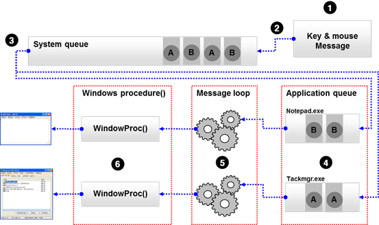

# LOOT AT ME!

> **date**: 22.12.01 - <br>
> **author**: timothy-20 <br>
> **subject**: windows mfc programming 이해를 위한 학습 내용.

[Windows Procedures](https://learn.microsoft.com/en-us/windows/win32/winmsg/about-window-procedures)
---
MSDN 및 책의 내용을 참고하여 정리할 것. 중요한 섹션.

[Windows Message](https://learn.microsoft.com/ko-kr/windows/win32/winmsg/about-messages-and-message-queues)
---

Windows 기반 어플리케이션은 **이벤트 기반** 입니다. 
입력을 얻을 때 함수를 호출하는 것이 아닌 함수를 통해 입력이 전달될 때까지 기다립니다.
시스템은 앱의 다양한 창에 메시지를 전달합니다. 창은 연결된 [**window prosedures**](https://learn.microsoft.com/en-us/windows/win32/winmsg/window-procedures)(_procedure_: 처리, 절차, 방법, etc) 
함수를 통해 입력을 수신합니다. 만일 최상위 창이 몇 초 이상 메시지에 대한 응답이 없을 경우, 시스템은 창의 시각적 틍성과 동일한 **ghost window**로 전환합니다.

메시지는 시스템과 앱 모두에서 생성됩니다. 사용자가 외부 입력(마우스, 키보드 등의 장치 입력)을 수행할 때, 각 입력 이벤트에서는 메시지를 생성합니다.

메시지는 [**시스템 정의 메시지**](https://learn.microsoft.com/ko-kr/windows/win32/winmsg/about-messages-and-message-queues#system-defined-messages)와 [**애플리케이션 정의 메시지**](https://learn.microsoft.com/ko-kr/windows/win32/winmsg/about-messages-and-message-queues#application-defined-messages)가 있습니다.
기본적으로 메시지는 창 핸들, 메시지 식별자 및 매게 변수라는 두 값의 4가지 변수 집합으로 구성되어 있습니다.


시스템은 메시지를 2가지 방법으로 라우팅하는데 [**메시지 큐**라는 FIFO 큐에 게시하거나](https://learn.microsoft.com/en-us/windows/win32/winmsg/about-messages-and-message-queues#queued-messages), 
[직접 프로시저로 전달하는](https://learn.microsoft.com/en-us/windows/win32/winmsg/about-messages-and-message-queues#nonqueued-messages) 식으로 수행합니다.

#### 1. 대기 중인 메시지
> <br>
> 1. 전술한 것처럼, 외부 입력(이벤트)을 메시지로 변환하여 시스템 메시지 큐에 넣습니다. 
> 2. 

#### 2. 직접 전달되는 메시지
>

[Message Map이란?](https://learn.microsoft.com/en-us/cpp/mfc/reference/message-maps-mfc?view=msvc-170)
---

메시지 맵은 특정 메시지가 발생했을 때, 어떤 함수(**OnCreate** 같이 요소의 생성 시 발생하는 메시지 핸들러 함수)를 호출해야 하는지 명시하는 매크로의 집합입니다([출처](https://holyhacker.tistory.com/89)).
window mfc의 메크로 구현은 WIN32 API의 창 프로시저 함수에서의 switch case문을 대체한 것 입니다.

[Message Map Macros(MFC)](https://learn.microsoft.com/ko-kr/cpp/mfc/reference/message-map-macros-mfc?view=msvc-170)
---

메시지 맵을 지원하기 위한 mfc의 매크로입니다.<br>
아래는 visual studio 기본 mfc 앱 프로젝트의 메시지 맵 정의입니다.

``` c++
BEGIN_MESSAGE_MAP('view 클래스명', CView)
	// 표준 인쇄 명령입니다.
	ON_COMMAND(ID_FILE_PRINT, &CView::OnFilePrint)
	ON_COMMAND(ID_FILE_PRINT_DIRECT, &CView::OnFilePrint)
	ON_COMMAND(ID_FILE_PRINT_PREVIEW, &CTKMFCApplication221130View::OnFilePrintPreview)
	ON_WM_CONTEXTMENU()
	ON_WM_RBUTTONUP()
	ON_WM_CREATE() // OnCreate와 같은 메시지 핸들러 함수들을 
END_MESSAGE_MAP()
```

주의 깊게 볼 것은 __ON_WM_CREATE()__ 함수입니다.

