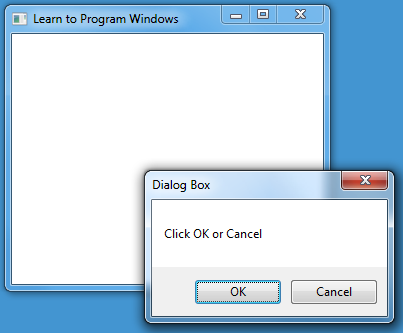

# LOOT AT ME!

> **date**: 22.12.02 -  
> **author**: timothy-20  
> **subject**: windows mfc programming 이해를 위한 학습 내용.

#### ※ 해당 README는 문서를 정리한 내용에 가깝습니다.

[창(Window) 이란?](https://learn.microsoft.com/ko-kr/windows/win32/learnwin32/what-is-a-window-)
---
Windows programming에서 창의 개념은 포괄적입니다. 버튼, 편집 상자 등의 ui control 요소들도 창에 해당합니다.

특징을 정리하자면
- 화면의 특정 부분을 차지한다.
- 특정 시점에 표시되거나, 표시되지 않을 수 있다.
- 스스로를 그릴 수 있다(onPaint, onDraw).
- 사용자 혹은 운영체제의 이벤트에 응답한다(ui control).

[부모 창과 자식 창](https://learn.microsoft.com/ko-kr/windows/win32/learnwin32/what-is-a-window-#parent-windows-and-owner-windows)
---

> 출처: [**MSDN - 부모 Windows 및 소유자 Windows** 섹션에서 2번째 이미지](https://learn.microsoft.com/ko-kr/windows/win32/learnwin32/what-is-a-window-#parent-windows-and-owner-windows)

어플리케이션 창과 ui control 창의 관계에서도 알 수 있다시피, 이 둘은 창의 부모 자식 관계에 있습니다. 그리고 위의 이미지에서는 어플리케이션 창과 모달 창 간의 관계도 보이는데, 이를 **소유자 창**과 **소유 창**의 관계라고 합니다.
소유 창은 항상 소유자 창 앞에 위치하게 됩니다.

[창 핸들](https://learn.microsoft.com/ko-kr/windows/win32/learnwin32/what-is-a-window-#window-handles)
---
windows programming에서 매우 핵심적인 개념인 **HWND**가 이에 해당합니다. 이는 **CreateWindow** 및 **CreateWindowEx**에서 생성합니다.
창 핸들은 포인터가 아닌 구조체로 되어 있음을 유의해야 합니다.

[화면 및 창 좌표](https://learn.microsoft.com/ko-kr/windows/win32/learnwin32/what-is-a-window-#screen-and-window-coordinates)
---

> 출처: [**MSDN - 화면 및 창 좌표** 섹션에서 2번째 이미지](https://learn.microsoft.com/ko-kr/windows/win32/learnwin32/what-is-a-window-#parent-windows-and-owner-windows)

해당 항목은 이전 openGL, ios 코드를 이용한 ui 구성 등의 개념에서 무척이나 친숙했습니다. 
기억해야 할 것은 좌표는 디바이스 독립적 픽셀로 측정된다는 사실입니다(이후에 부가적인 설명이 있을 예정). 
위 이미지에서 보여지는 것처럼 **각 영역 간의 좌표 값**이 다릅니다. 각 영역을 구별하여 창을 배치하는데 실수가 없어야 하겠습니다.

