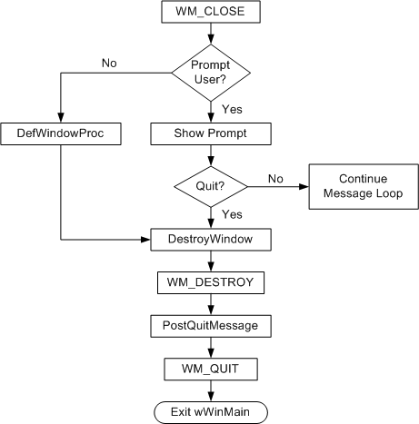
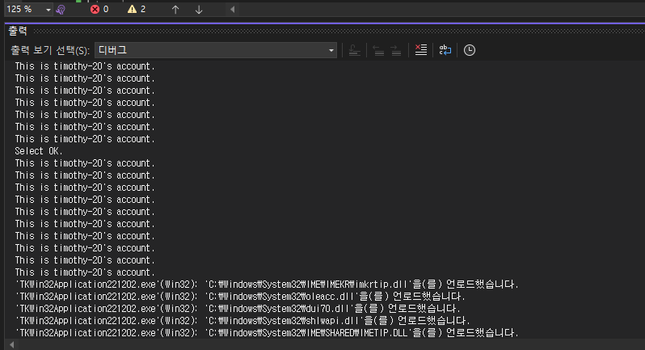

# LOOT AT ME!

> **date**: 22.12.02 - <br>
> **author**: timothy-20 <br>
> **subject**: windows api programming 실습.

#### ※ 해당 README는 문서는 실습 내용을 정리하고 있습니다.

### [창 구현하기](https://learn.microsoft.com/ko-kr/windows/win32/learnwin32/your-first-windows-program)

---

> visual studio 설정에서 기존에 mfc 빌드를 위해 '**MFC 사용 설정**'을
> '**공유 DLL에서 MFC 사용**'에서 '**표준 Windows 라이브러리 사용**' 으로 돌려 놓아야 합니다.

```c++
//main.h

#ifndef UNICODE
#define UNICODE
#endif

#include <windows.h>

//WindowProc 함수는 개념에서 두드러졌던 창의 프로시저입니다.
//창의 모양, 사용자와의 상호작용 방식 등의 동작을 정의합니다.
//WNDCLASS 구조체에 함수 포인터 형태로 등록됩니다.
//WindowProc 프로시저 함수의 매게변수에 대한 설명은 아래와 같습니다.
//1. hWnd는 창에 대한 핸들입니다.
//2. uMsg는 메시지 코드입니다. DispatchMessage 함수를 통해 전달된 MSG 구조체의 메시지 코드가 맞습니다.
//3. wParam, lParam은 메시지와 관련된 추가 데이터입니다.
LRESULT CALLBACK WindowProc(HWND hWnd, UINT uMsg, WPARAM wParam, LPARAM lParam) //CALLBACK은 함수에 대한 호출 규칙입니다.
{
	switch (uMsg)
	{
	case WM_DESTROY:
		PostQuitMessage(0);
		return 0;

	case WM_PAINT:
		PAINTSTRUCT ps;
		HDC hdc = BeginPaint(hWnd, &ps);

        //rcPaint 멤버는 paint update 관련 지역에 대한 값입니다.
        //FillRect 함수의 3번째 매게변수에는 HBRUSH 변수를 통해 view에서 업데이트 될 색상을 지정합니다.
		FillRect(hdc, &ps.rcPaint, (HBRUSH)(COLOR_WINDOW + 1));
		EndPaint(hWnd, &ps);

		return 0;
	}

	return DefWindowProc(hWnd, uMsg, wParam, lParam);
}

//wWinMain 함수는 프로그램의 진입점입니다.
int WINAPI wWinMain(HINSTANCE hInstance, HINSTANCE hPrevInstance, PWSTR pCmdLine, int nCmdShow)
{
	const wchar_t CLASS_NAME[] = L"TKWindowClass001";
    
    //WNDCLASS 구조체는 창 클래스에 대한 구조체입니다. 여러 창의 공통적인 동작 집합을 정의합니다.
    //창 클래스가 c++에서의 class 개념과 다르다는 사실을 유의해야 합니다.
	WNDCLASS wc = {};

	wc.lpfnWndProc = WindowProc; //창 프로시저 함수 포인터(콜백)입니다. 창 동작의 대부분을 정의합니다.
	wc.hInstance = hInstance; //앱 인스턴스의 핸들입니다.
	wc.lpszClassName = CLASS_NAME; //창을 식별하는 문자열입니다

	RegisterClass(&wc); //운영체제에 창 클래스를 등록합니다.

	HWND hWnd = CreateWindowEx(
		0, //윈도우 스타일에 대해 선택적인 동작(ex. 투명 창)이 가능합니다. 기본 스타일은 0을 설정합니다.
		CLASS_NAME, //창 클래스명입니다.
		L"Learn windows programming", //창의 제목 표시줄에 들어갈 문자열입니다.
		WS_OVERLAPPEDWINDOW,  //창의 모양을 정의하는 플래그 집합입니다. WS_OVERLAPPEDWINDOW는 모든 창의 일반적인 스타일이 전부 정의되어 있습니다.
		CW_USEDEFAULT, CW_USEDEFAULT, CW_USEDEFAULT, CW_USEDEFAULT, //x, y, cx, cy, 위치 및 크기에 대한 정의입니다.
		NULL, //소유자의 창입니다. 해당 창이 최상위에 있을 경우 NULL을 설정합니다.
		NULL, //창의 메뉴를 정의합니다. NULL이면 설정되지 않습니다.
		hInstance, //인스턴스 핸들입니다.
		NULL //임의 데이터에 대한 포인터입니다. 프로시저(콜백)에 데이터 구조를 전달할 수 있습니다.
	);

	if (hWnd == NULL) 
		return 0;

    //새 창에 대한 핸들을 전달하여 화면에 표시합니다.
    //nCmdShow 매게변수를 이용하여 창을 최소화하거나 최대화 할 수 있습니다.
	ShowWindow(hWnd, nCmdShow);

    //프로그램의 실행 흐름 가운데, 예측하기 어려운 이벤트(사용자, 운영체제)를 감지합니다.
    // 아래의 메시지 구조체에 대상 창 및 메시지 코드(WM_LBUTTONDOWN, 마우스 좌클릭에 대한 코드)가 포함됩니다.
	MSG msg = {};

    //해당 루프는 올바른 창 프로시저로 메시지를 전달합니다.
	while (GetMessage(&msg, NULL, 0, 0) > 0)
	{
		TranslateMessage(&msg); //사용자의 키보드 입력 이벤트를 감지합니다. 해당 함수는 DispatchMessage보다 먼저 발생해야 합니다.
		DispatchMessage(&msg); //창의 프로시저(콜백)을 호출하도록 지시합니다. 이때 GetMessage 통해 받았던(msg 구조체에 담긴) 이벤트를 프로시저에 전달합니다.
	}

	return 0;
}
```

소스 코드의 주석은 MDNS 문서의 '첫 번째 Windows 프로그램' 항목의 가이드를 정리했음을 알려드립니다.

### [창 제거 흐름](https://learn.microsoft.com/ko-kr/windows/win32/learnwin32/closing-the-window)

---



> 출처: **MSDN - 화면 및 창 좌표** 섹션에서 2번째 이미지 

```c++
case WM_CLOSE:
    if (MessageBox(hWnd, L"Do you want quit?", L"Notice", MB_OKCANCEL) == IDOK)
    {
        OutputDebugString(L"Select OK.\n");
        DestroyWindow(hWnd);
    }
    else
    {
        OutputDebugString(L"Select CANCLE.\n");
    }
			
    return 0;
```
WM_CLOSE에 대한 상태를 감지하는 case는 위와 같습니다.
사용자가 창을 닫는 이벤트를 발생할 시, 창을 파괴하기 이전에 호출됩니다. 이는 창 종료 여부를 묻는 모달을 발생시키에는 최적의 시점입니다.

### [앱 상태 관리](https://learn.microsoft.com/ko-kr/windows/win32/learnwin32/managing-application-state-)

---

```c++
struct TKUserAccount
{
	UINT16 userId;
	const wchar_t* userName;
	const wchar_t* userDescription;
};
```

우선 사용자 정보를 담는 임의의 구조체를 생성합니다.

```c++
//wWinMain function
TKUserAccount *userAccount = new(std::nothrow) TKUserAccount();
	userAccount->userId = 0;
	userAccount->userName = L"timothy-20";
	userAccount->userDescription = L"This is timothy-20's account.";

	HWND hWnd = CreateWindowEx(
		0,
		CLASS_NAME,
		L"Learn windows programming",
		WS_OVERLAPPEDWINDOW,
		CW_USEDEFAULT, CW_USEDEFAULT, CW_USEDEFAULT, CW_USEDEFAULT,
		NULL,
		NULL,
		hInstance,
		userAccount
	);
```

포인터 userAccount를 초기화 한 뒤 **CreateWindowEx** 함수의 마지막 void* 파라미터에 해당 구조체를 넘겨줍니다.

```c++
//WindowProc CALLBACK function
TKUserAccount* userAccount = nullptr;

	if (uMsg == WM_CREATE)
	{
		CREATESTRUCT* cs = reinterpret_cast<CREATESTRUCT*>(lParam);
		userAccount = reinterpret_cast<TKUserAccount*>(cs->lpCreateParams);

		SetWindowLongPtr(hWnd, GWLP_USERDATA, (LONG_PTR)userAccount);
	}
```

해당 값은 WindowProc 콜백의 WM_CREATE 메시지 수신 때부터 lParam 변수의 **CREATESTURCT** 구조체를 통해 확인할 수 있습니다. 
이때 구조체의 **lpCreateParams** 멤버의 void* 값을 TKUserAccount* 타입으로 변환해줍니다.
초기화 하였던 TKUserAccount의 구조체로 수신하였고 이를 **SetWindowLongPtr** 함수를 통해 창의 인스턴스 데이터에 해당 포인터 구조체를 등록합니다.

```c++
else 
	{
		LONG_PTR lp = GetWindowLongPtr(hWnd, GWLP_USERDATA);
		userAccount = reinterpret_cast<TKUserAccount*>(lp);

		if (userAccount != nullptr)
		{
			OutputDebugString(userAccount->userDescription);
			OutputDebugString(L"\n");
		}
	}
```
최초 생성 시점 이후로 모든 메시지 발생 상황에서 창 인스턴스에 등록된 사용자 정의 구조체를 다시 가져옵니다.

<br>
따로 시점을 정해두지 않으니, 앱이 동작하는 동안의 모든 이벤트 상황에서 호출되었습니다. 정상적으로 userAccount의 userDescription을 출력합니다.
