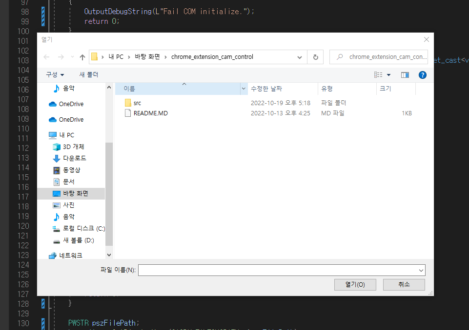
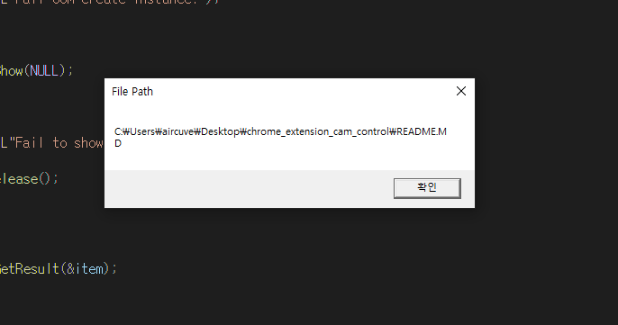

# LOOT AT ME!

> **date**: 22.12.05 - <br>
> **author**: timothy-20 <br>
> **subject**: WinAPI의 COM 라이브러리에 대하여.<br>
> **project name**: TKMFCApplication221201

### [의사 요소 예제를 통해 COM 바라보기](https://learn.microsoft.com/ko-kr/windows/win32/learnwin32/creating-an-object-in-com)

---

```c++
//global
interface IDrawable
{
	void Draw();
};

extern const GUID CLSID_Shape;
extern const GUID IID_IDrawable;


//wWinMain function
IDrawable* shape;
HRESULT hr = CoInitializeEx(NULL, COINIT_APARTMENTTHREADED | COINIT_DISABLE_OLE1DDE);
hr = CoCreateInstance(CLSID_Shape, NULL, CLSCTX_INPROC_SERVER, IID_IDrawable, reinterpret_cast<void**>(&shape));

if (SUCCEEDED(hr))
{
    //shape 객체를 사용할 수 있습니다.
}
else
{
    //무언가 오류가 있습니다.
}

CoUninitialize();

```

### [열기 대화 상자 예제를 통해 COM 바라보기](https://learn.microsoft.com/ko-kr/windows/win32/learnwin32/example--the-open-dialog-box)

---

```c++
HRESULT hr = CoInitializeEx(NULL, COINIT_APARTMENTTHREADED | COINIT_DISABLE_OLE1DDE);
// COM 라이브러리를 초기화합니다.

if (SUCCEEDED(hr))
{
    IFileOpenDialog* fileOpenDialog;
    hr = CoCreateInstance(CLSID_FileOpenDialog, NULL, CLSCTX_ALL, IID_IFileOpenDialog, reinterpret_cast<void**>(&fileOpenDialog));
    // Common item dialog를 만듭니다. IFileOpenDialog에 대한 포인터를 가져옵니다.
    
    if (SUCCEEDED(hr))
    {
        hr = fileOpenDialog->Show(NULL);
        // 대화 상자를 표시합니다. 대화 상자는 사용자가 해제하기 이전까지 창을 차단합니다.

        if (SUCCEEDED(hr))
        {
            IShellItem* item;
            hr = fileOpenDialog->GetResult(&item);
            // Shell 항목 개체라는 두 번째 DOM 개체를 받습니다.
            // IShellItem 인터페이스를 구현하는 항목은 사용자가 선택한 파일을 나타냅니다.

            if (SUCCEEDED(hr))
            {
                PWSTR pszFilePath;
                hr = item->GetDisplayName(SIGDN_FILESYSPATH, &pszFilePath);
                //문자열 형식의 파일 경로를 가져옵니다.
                
                if (SUCCEEDED(hr))
                {
                    MessageBox(NULL, pszFilePath, L"File Path", MB_OK);
                    // 메시지 상자를 통해 파일 경로를 표시합니다.
                    CoTaskMemFree(pszFilePath);
                }

                item->Release();
            }
        }

        fileOpenDialog->Release();
    }

    CoUninitialize();
}
```
중첩 if를 피하려는 시도를 하였으나, Reference Couting에 대한 처리에 있어 가장 적절하게 짜여져 있음을 인정하여 문서와 동일하게 구현하였습니다.

### 결과 화면

---



> file open dialog가 발생합니다. README.MD 파일을 선택해 진행했습니다.



> 메시지 박스에서 파일 경로가 표시됩니다.
