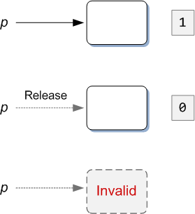

# LOOT AT ME!

> **date**: 22.12.06 - <br>
> **author**: timothy-20 <br>
> **subject**: COM 개체의 수명 관리에 대하여.<br>
> **project name**: TKMFCApplication221201

### [개체의 수명 관리](https://learn.microsoft.com/ko-kr/windows/win32/learnwin32/managing-the-lifetime-of-an-object)

---
모든 COM 인터페이스 개체는 **IUnknown 인터페이스**를 직, 간접적으로 상속하여, 개체의 수명을 제어하는데 사용합니다.
인터페이스는 3가지 메서드를 정의하는데,
- QueryInterface(런타임에 개체의 기능을 쿼리할 수 있다. 추후에 자세히 다룹니다.)
- AddRef
- Release

계속해서 알아볼 COM의 개체(포인터 객체)의 수명 관리 방식인 **Reference Counting**을 위해 'AddRef'와 'Release'에 주목해 보고자 합니다.

참조 카운터에 대한 객체 관리는 필자의 iOS 앱 개발을 통해 익숙해진 개념이었습니다. 하지만 iOS도 이제는 RC의 기술을 내부적으로 처리하는 
**Auto Reference Counting**을 이용하여 RC의 번거로운 동작을 숨겼기 때문에, '순환 참조'로 골치를 앓기 전까지는 알지 못했습니다.


기본적으로 RC 개체는 생성, 복사 시의 참조 횟수를 기록하는 카운터를 가지고 있습니다.
대한 포인터 사용을 마치면 **Release**를 호출함으로써 참조 횟수를 줄입니다. 참조 횟수가 0이 되는 시점에 개체는 자체적으로 삭제됩니다.



> 출처: **MSDN - 객체의 수명 관리** 섹션에서 1번째 이미지

객체 생성 시의 흐름입니다.


> 출처: **MSDN - 객체의 수명 관리** 섹션에서 2번째 이미지 

객체 생성 이후, 다른 포인터로 접근했을 시의 흐름입니다.

### [예제를 통해 Reference Counting을 이해해보자](https://learn.microsoft.com/en-us/windows/win32/learnwin32/managing-the-lifetime-of-an-object#example)

---
해당 이론은 앞서 'LOOKATME!221205_COM.md'에서 실습했던 예제에서도 잘 드러나고 있습니다. 아래는 RC에 대한 예시가 되는 2가지 구간입니다.

```c++
hr = CoCreateInstance(CLSID_FileOpenDialog, NULL, CLSCTX_ALL, IID_IFileOpenDialog, reinterpret_cast<void**>(&fileOpenDialog));
//인스턴스 생성 성공 후...

fileOpenDialog->Release();
```

```c++
IShellItem* item;
hr = fileOpenDialog->GetResult(&item);
//아이템 반환 성공 후...

item->Release();
```

### [개체에 인터페이스 요청](https://learn.microsoft.com/en-us/windows/win32/learnwin32/asking-an-object-for-an-interface)

---
COM 개체의 'QueryInterface'를 사용합니다.
QueryInterface 는 C++에서 dynamic_cast 키워드의 언어 독립적 버전으로 생각할 수 있습니다.

추가적인 작성 요함.

### [COM의 메모리 할당](https://learn.microsoft.com/en-us/windows/win32/learnwin32/memory-allocation-in-com)

---
COM이 자체 메모리 할당 기능을 정의하는데 의문이 있었다. c에는 동적 메모리 관리를 위해 malloc(), free() 함수가, 
c++에는 new, delete 키워드가 존재한다.
한 가지 이유는 힙 할당자에 대한 추상화 계층을 제공하는 것입니다. 
그렇지 않으면 일부 메소드는 malloc 을 호출하고 다른 메소드는 new 를 호출할 수 있습니다 .

추가적인 작성 요함.