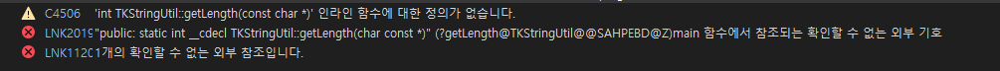
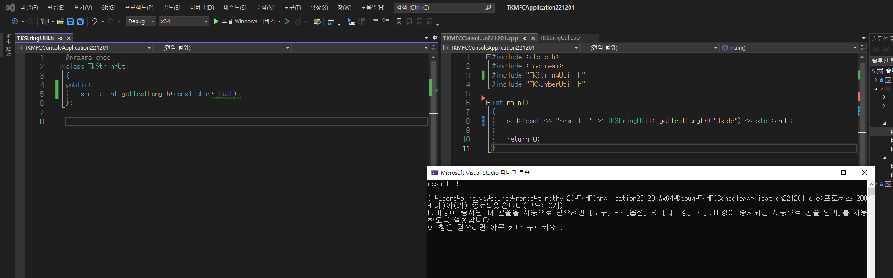

# LOOT AT ME!

> **date**: 22.12.06 - <br>
> **author**: timothy-20 <br>
> **subject**: c++ 적용 실습 중 막힌 부분에 대하여.<br>
> **project name**: TKMFCApplication221201

22.12.06. 09:46에 발견한 이슈
---
> 도움이 되었던 글: 
> - https://stackoverflow.com/questions/5373107/how-to-implement-static-class-member-functions-in-cpp-file
> - https://boycoding.tistory.com/167
> - https://boycoding.tistory.com/220

```c++
//TKStringUtil.h
#pragma once
class TKStringUtil
{
public:
	static constexpr int getLength(const char* text);
};
```
```c++
//TKStringUtil.cpp
#include "TKStringUtil.h"

constexpr int TKStringUtil::getLength(const char* text)
{
	int index(0);

	while (*(text + index) != '\0')
		index++;

	return index;
}
```
보이는 바와 같이 문자열의 길이를 구하는 간단한 유틸리티 함수입니다.
이를 엔트리 포인트에서 실행시키려고 했을 때, **확인 할 수 없는 외부 참조**에 대한 에러를 보고했습니다.



> 함수에 대한 정의 또한 찾지 못하고 있습니다.

해결 방안
---
문제는 처음 예상했던 잘못된 static 함수의 사용이 아닌, constexpr 키워드에 있었습니다.

주목해 볼 만한 사실은 **'int TKStringUtil::getLength(const char \*)' 인라인 함수에 대한 정의가 없습니다.** 라는 것입니다.
해당 문장에서 3가지 사실을 파악할 수 있었는데,
1. 컴파일러는 'getLength'를 inline 함수로 해석했다(컴파일러는 함수를 인라인으로 사용할 수 있을 것이라 판단하면, 자체적으로 최적화 합니다).
2. 컴파일러는 'getLength'를 **constexpr 함수로 해석하지 않았다.**
3. 'getLength'에 매게 변수로 넘기는 값은 포인터이다. 하지만 constexpr 함수는 컴파일 타임 상수가 아닌 다른 값을 전달 받았을 경우 일반 함수로 해석된다.

애시당초 함수 설계가 잘못되었음을 알 수 있었습니다. 'getLength'는 constexpr 함수일 수 없었습니다. 컴파일러에서 해석하는 헤더 파일의 
'getLength'(int TKStringUtil::getLength)가 .cpp에서의 'getLength'(constexpr int TKStringUtil::getLength)와는 달랐기에 함수의 구현부를 찾아낼 수 없었던 것입니다.

constexpr 키워드를 지우고 재실행하였습니다.



> **result: 5** //정상적으로 출력됩니다.

함수가 꼭 constexpr을 위해서가 아니더라도 키워드를 사용할 수 있습니다(인자 값에 따라 일반 함수로도 동작하기 때문). 하지만 위와 같이
컴파일 과정에 지정을 주는 선언을 하는 경우에는 constexpr의 용법을 정확히 이해하고 사용하여야 겠습니다.