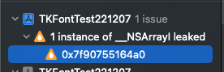
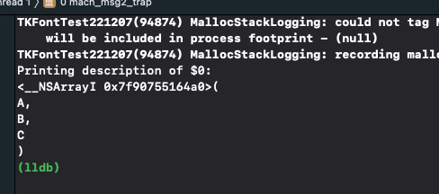

# LOOT AT ME!

> **date**: 22.12.07 - <br>
> **author**: timothy-20 <br>
> **subject**: objc __bridge 키워드 복습 중 막힌 부분에 대하여.<br>
> **project name**: TKMFCApplication221201

22.12.07. 17:14에 발견한 이슈
---
> 도움이 되었던 글:
> - http://seorenn.blogspot.com/2015/01/objective-c-arc.html

``` objective-c++
//ViewController.m

//main view 생성 이후에 상황을 모니터링 하기 위해서 'viewDidAppear에서 선언해 두었음.
-(void)viewDidAppear:(BOOL)animated
{
    [super viewDidAppear:animated];
    
    CFStringRef strs[3] = {CFSTR("A"), CFSTR("B"), CFSTR("C")};
    CFArrayRef cfArray = CFArrayCreate(kCFAllocatorDefault, (const void**)strs, 3, &kCFTypeArrayCallBacks);
    NSArray* nsArray = (__bridge NSArray*)cfArray;
}
```
**CFArrayRef**를 **NSArray**로 형 변환(bridge) 이후, 'cfArray' 변수를 **CFRelease**를 통해 메모리를 해제해 주지 않았습니다. 
이는 이전에 필자가 Core Foundation 라이브러리를 사용하는 과정에서 빈번히 간과했던 부분이었는데, 이번에 __bridge 키워드를 사용하게 되면서
재점검해 보았습니다.



xcode 디버거의 memory graph를 이용해 메모리 릭이 발생하는 것을 확인했습니다. 



역시 제가 형 변환 이후 할당 해제하지 않은 'cfArray' 입니다.

해결 방안
---
``` objective-c++
CFRelease(cfArray);
```
앞서 말했듯, 할당 해제 해주면 됩니다.

기본적으로 NSType에서 CFType으로의 bridge 형 변환에 대해서는 CFType의 변수에 대해서 할당 해제해 줄 필요가 없지만(NSType 원본 값이 ARC를 통해 스코프를 벗어나면 할당 해제됩니다), 
CFType이 원본인 경우에 원본 값에 대한 어떤한 retain 혹은 release를 걸지 않습니다(일반적인 RC 방식으로 관리해주어야 합니다).

그렇기에 CFArrayCreate에서 Retain 걸린 것을 반드시 스코프가 종료되기 이전에 할당 헤제해 주어야 합니다.

