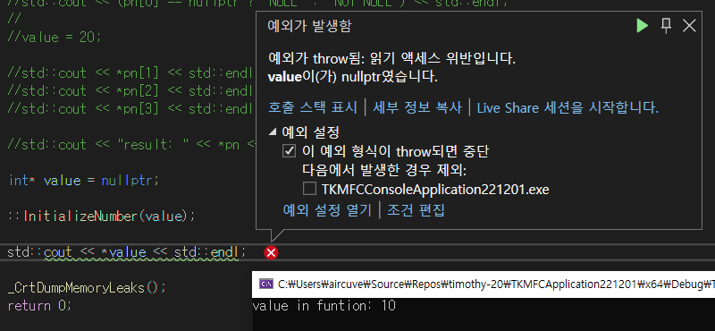
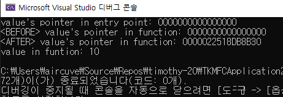

# LOOT AT ME!

> **date**: 22.12.08. - <br>
> **author**: timothy-20 <br>
> **subject**: c++ 문법에 대하여.<br>
> **project name**: TKMFCApplication221201

배열과 포인터
---
>출처: https://boycoding.tistory.com/201

배열과 포인터의 동일성에 대한 환상은 컴파일러의 암시적 변환에 의해서 더욱 신빙성을 얻었습니다([Effective Modern C++](https://g.co/kgs/iRgvN3)에서 인상 깊었던 설명을 발췌하였습니다).
무엇이 배열과 함수를 유사하게 보이게 한 것일까요?

```c++
inline int GetArraySize(int array[]) { return (int)sizeof(array); }

//entry point
int nArray[10] = {0,};
::InitializeArray(nArray);
```
'InitializeArray'는 배열의 크기를 구하는 함수입니다. 배열 매게 변수를 통해 값을 넘겨 크기를 구합니다. 배열의 경우 **sizof**를 이용하여
>sizeof(nArray) == **'integer type의 크기'** x **'배열 개수'**  

의 값을 반환받을 수 있습니다. 예상대로라면 결과는 **40**입니다. 하지만 결과로 받은 값은 **8**입니다. 이는 integer pointer의 크기입니다. **어째서 함수는 int[]을 int*로 받아들인 걸까요?**

일반적인 함수의 매게 변수는 값을 복사합니다. 하지만 큰 배열을 복사하는 것은 무척 비싼 행동입니다. 따라서 함수에 배열을 전달하게 되면
컴파일러는 이를 포인터로 변환합니다.

그렇기에 난감한 상황에 빠졌습니다. 필자는 빈 배열을 특정 값으로 초기화하는 함수도 만들 계획이 있었기 때문입니다.

```c++
inline void InitializeArray(int array[]) { 
    int size = (int)sizeof(array) / (int)sizeof(int); 
    //예상 배열의 size 10
    
    for (int i = 0; i < size; i++)
        array[i] = i * 2;
}
```
위 함수는 올바르게 동작할 것을 기대할 수 없습니다. 이제는 무척 이상한 코드처럼 보이는군요.

```c++
inline void InitializeArray(int array[], const size_t arraySize);

//template 사용
template<int ARRAY_SIZE>
inline void InitializeArray(int array[]);
```
함수에 따로 배열의 크기를 받을 수 밖에 없겠습니다. 매게 변수를 하나 더 만들거나, template을 이용할 수 있습니다. 이로써 알 수 있는 것은

```c++
void SetArray(int array[]); // 그래도 배열 인수로 표시해주는 것을 선호함.
void SetArray(int* array);
```
위 두 함수는 다르지 않다는 사실입니다. 실제로 배열로 선언된 변수는 포인터처럼 접근할 수 있습니다.

```c++
//entry point
int array1[] = {0,};
int element = *array1; //배열의 첫 번째 값을 대입.
```
이 때도 매게 변수 때와 다르지 않게 포인터로 배열 요소에 접근할 시, 암시적으로 'array1'이 포인터로 변환됩니다.

이중 포인터와 이중 포인터 매게 변수
---
>출처:
> - https://boycoding.tistory.com/212
> - https://dojang.io/mod/page/view.php?id=1962
```c++
//1차 시도
inline void InitializeNumber(int* pn)
{
    pn = new int(0);
}

//entry point
int* pn = nullptr;

::InitializeNumber(pn);
```
가장 단적인 시도이지만, 'pn'은 초기화되지 않고 여전히 nullptr입니다. 'InitializeNumber'에 있는 'pn'은 동적 할당 이후 범위를 벗어나면 사용할 수
없게 됩니다. 필자가 가장 의아했던 부분이지만,

```c++
inline void InitializeNumber(int* pn)
{
    pn = new int(0);
    
    std::cout << "value in function: " << *pn << std::endl; 
}
```



> 정확히 함수 스코프에 대한 부분까지 값이 유효합니다.

이는 'InitializeNumber'의 매게 변수인 'pn'과 원본값인 'value'가 달라졌기 때문입니다. 



기본적으로 매개변수는 원본값을 복사하여 사용하는데 이때까지는
'pn'도 <b>'value'(== '0000000000000000/nullptr)</b>도 동일한 주소를 바라보고 있습니다. 하지만 'pn'이 새로운 값을 동적 할당 받은 시점부터 'value'와는 관계 없는
'InitializeNumber' 함수 스코프 안에서만 유효한 <b>'pn'(== 0000022518DB8B30)</b>이 됩니다. 그러므로 함수가 종료되는 시점에 'pn'은 해제되지 않은 포인터 변수로써 메모리 릭을 발생시킵니다.

이리하여 1차 시도는 실패입니다. 포인터 매게 변수는 값을 초기화하는데 부적합했습니다. 

```c++
inline bool IncreaseNumber(int* pl)
{
	if (pl == nullptr)
		return false;

	*pl += 10;
	return true;
}

//entry point
int* pn = new int(10);

::IncreaseNumber(pn);
```
대신 포인터 매게 변수는 적은 코스트로 값을 전달하거나(주소값 전달), 넘겨진 포인터 값을 변경하는 경우 용이하게 사용할 수 있겠습니다.

```c++
//2차 시도
inline void InitializeNumber(int** ppl)
{
    int initialValue = 1;
    *ppl = &initialValue;
}
```