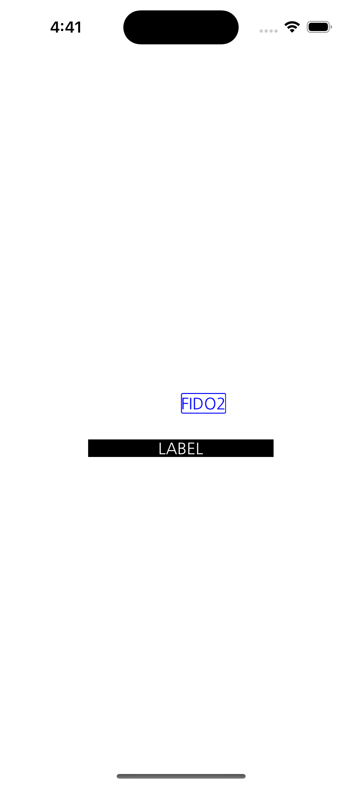

# LOOT AT ME!

> **date**: 22.12.12. -  
> **author**: timothy-20  
> **subject**: custom font를 사용하던 중, 엇나간 vertical text align 조정하던 중 알아낸 것에 대햐여  
> **project name**: TKMFCApplication221201

22.12.12. 15:56에 발견한 이슈
---
> 도움이 되었던 글:
> - https://stackoverflow.com/questions/9015317/custom-uifont-baseline-shifted
> - https://www.andyyardley.com/2012/04/24/custom-ios-fonts-and-how-to-fix-the-vertical-position-problem/
> - https://stackoverflow.com/questions/7535498/uibutton-custom-font-vertical-alignment/8314197#8314197

 
> 조정 이전의 custom font 적용 UILabel입니다. lineHeight이 동일하게 맞춰져 있음에도 불구하고 바닥으로부터 살짝 떨어진 모습입니다.

 
> font 위치 조정 값들을 확인해 보았습니다. **leading** 값은 0.0f 입니다.

 
> baseline 값을 조정한 결과입니다. **descender**의 반만큼 baseline을 낮췄지만 예상보다 더 아래에 위치하고 있습니다.

~~~ objective-c++
-(void)setLineHeight:(CGFloat)lineHeight text:(NSString *)text
{
    NSMutableParagraphStyle* style = [[NSMutableParagraphStyle alloc] init];
    
    style.maximumLineHeight = lineHeight;
    style.maximumLineHeight = lineHeight;
    style.alignment = NSTextAlignmentCenter;

    NSDictionary<NSAttributedStringKey, id>* attributes = @{NSParagraphStyleAttributeName: style,
                                                            NSBaselineOffsetAttributeName: @(self.font.descender / 2)};
    self.attributedText = [[NSAttributedString alloc] initWithString:text attributes:attributes];
}

//entry point
[self->p_label setLineHeight:self->p_label.frame.size.height text:@"FIDO2"];
~~~

문제에 대한 해결책을 제시한 글에 따르면 **custom font의 asender 값이 system font에 비해 너무 작다는 것**이 원인이었습니다.
따라서 xcode의 [**font tool suite**](https://developer.apple.com/download/all/?q=font)를 이용하기로 했습니다.

> ~$ ftxdumperfuser -t hhea -A d NanumGothicOTF.otf

해당 터미널 명령어를 이용하여 **NanumGothicOTF.hhea.xml**을 생성했습니다. 아래는 파일의 내용입니다.

~~~ xml
<hheaTable
	versionMajor="1"
	versionMinor="0"
	ascender="1100" 
	descender="-300"
	lineGap="0"
	advanceWidthMax="1090"
	minLeftSideBearing="0"
	minRightSideBearing="-152"
	xMaxExtent="1004"
	caretSlopeRise="1"
	caretSlopeRun="0"
	caretOffset="0"
	metricDataFormat="0"
	numberOfHMetrics="18271"
	/>
~~~
> **ascender**를 기존 800에서 1100으로 변경해보았습니다.

> ~$ ftxdumperfuser -t hhea -A f NanumGothicOTF.otf 

위 명령어로 다시 .otf을 병합합니다.

 
> **sizeToFit** 함수를 통해 Label 크기를 조정한 후, 테스트해 보았습니다.

전보다 훨씬 나아보입니다. 그렇다면 기종별 반응형 테스트도 진행해 보겠습니다.

 
> iPhone 8 시뮬레이터 화면 캡쳐입니다.

 
> iPhone 14 Pro 시뮬레이터 화면 캡쳐입니다.

확인해본 결과 반응형 상황에서도 문제 없었습니다.