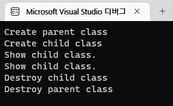
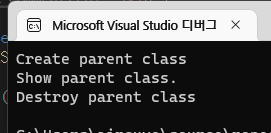
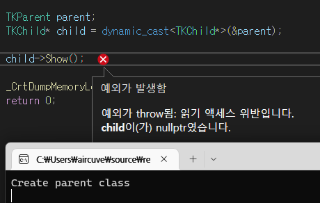

# LOOT AT ME!

> **date**: 22.12.13. - <br>
> **author**: timothy-20 <br>
> **subject**: c++ 문법에 대하여.<br>
> **project name**: TKMFCApplication221201

C++ 타입 캐스팅
---
> 참고한 글들:
> - [명시적 형 변환(c-style cast, static_cast)](https://boycoding.tistory.com/177)
> - [static_cast](https://blockdmask.tistory.com/236)
> - [const_cast](https://blockdmask.tistory.com/240)
> - [dynamic_cast](https://blockdmask.tistory.com/241)

1. **c-style cast**
```c++
int i1 = 20;
int i2 = 10;
float f1 = float(i1) / i2; //c++ style
float f2 = (float)i1 / i2;

std::cout << "result1: " << f1 << "\tresult2:" << f2 << std::endl;
```
아마도 가장 많이 볼 수 있는 예는 c언어에서의 동적 할당(malloc) 구문일 것입니다. 위 소스에서는 'i1' 변수의 float 타입 캐스팅을 통해서 'i2'의 [**암시적 변환**](https://boycoding.tistory.com/176?category=1008283)을
유도하고 있습니다. 따라서 'i1', 'i2' 모두 float 타입으로 나누기 연산이 수행됩니다.

해당 타입 변환 방식은 컴파일 시간에 검사되지 않으므로, 개발자의 실수가 일어나기 쉽습니다. 또한 const를 제거하는 등의 타입 변환에 있어 강한 강제성을 갖습니다.

---

2. **static_cast**
```c++
int letterNumber(97);
char letter(static_cast<char>(letterNumber));
char letterA('a');
int letterANumber(static_cast<int>(letterA));

std::cout << "result1: " << letterANumber << "\tresult2: " << letter << std::endl;
```
반면 **static_cast**의 경우 컴파일 타임에 검사를 수행하여 개발자의 부주의(잠재적으로 안전하지 않은 형 변환)로 인한 오류를 표시합니다.
이러한 이점은 c-style 형 변환보다 선호할만 합니다. 하지만 **상속 관계 이외의 포인터 타입의 형 변환 시에는 컴파일 에러를 발생**시키며,
**downcast 시에는 unsafe하게 동작할 수** 있습니다.

---

3. **dynamic_cast**
```c++
class TKParent
{
public:
	TKParent() { std::cout << "Create parent class" << std::endl; }
	virtual ~TKParent() { std::cout << "Destroy parent class" << std::endl; }

	virtual void Show()
	{
		std::cout << "Show parent class." << std::endl;
	}
};

class TKChild : public TKParent
{
public:
	TKChild() { std::cout << "Create child class" << std::endl; }
	~TKChild() { std::cout << "Destroy child class" << std::endl; }

	void Show()
	{
		std::cout << "Show child class." << std::endl;
	}
};

//entry point
TKParent* parent = new TKChild();

parent->Show();

TKChild* child = dynamic_cast<TKChild*>(parent);

if (child != nullptr)
    child->Show();

delete parent;
```
<br>
<b>다형성(polymorphism)</b>의 개념이 잘 드러나고 있습니다. 이와 같이 상위 클래스에서 하위 클래스 타입으로 형 변환이 이루어지는 경우(downcast)
dynamic_cast는 다른 형 변환 연산자들과는 다르게 **안전한 형 변환을 수행**합니다. 런타임 상황에서 downcast 여부를 검사하고, 안전하지 않은 경우 nullptr(포인터 형 변환의 경우) 혹은 예외를 던집니다.
때문에 cost가 높은 형 변환 연산자입니다.

다음은 static_cast와 dynamic_cast를 비교하며 테스트를 진행하였습니다.

- static_cast 포인터 형 변환
```c++
TKParent parent = TKParent();
TKChild* child = static_cast<TKChild*>(&parent);

child->Show();
```
<br>
> 'TKChild' 형태를 한 'TKParent'의 동작만이 보여집니다. 사실상 'TKChild'로의 형 변환이 이뤄지지 않은 모습입니다.
- dynamic_cast 포인터 형 변환
```c++
//...
TKChild* child = dynamic_cast<TKChild*>(&parent);
```
<br>
> nullptr를 반환하고 이를 호출하려고 하자 예외가 발생했습니다. 'TKChild'의 생성자가 없기 때문에 'child'를 생성하지 못했습니다.

애매한 정리이다. 수정 요함.

---

4. **const_cast**
```c++
const char* constName(new char[10]{ "Timothy" });
char* name(const_cast<char*>(constName));

name[0] = 'A';

std::cout << "result1: " << constName << "\tresult2: " << name << std::endl;
```
포인터 및 참조(reference)의 상수성(const 키워드)을 제거 및 **volatile 키워드**의 일시적인 제거에도 사용합니다, 그런 부분에서 형 변환을 수행하진 않습니다.