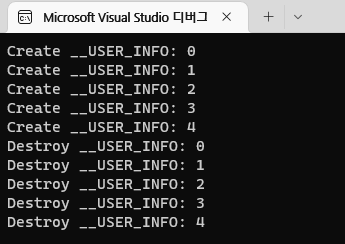

# LOOT AT ME!

> **date**: 22.12.14. - <br>
> **author**: timothy-20 <br>
> **subject**: c++ 문법을 익히던 도중 시도해 본 내용에 대하여.<br>
> **project name**: TKMFCApplication221201

unique_ptr
---
> 출처: https://modoocode.com/229

```c++
typedef struct __USER_INFO
{
private:
uint16_t m_userId;
bool m_isPrivate;

public:
const char* userName{ "" };
const char* userDescription{ "no descript." };

__USER_INFO() = default;
__USER_INFO(uint16_t userId, bool isPrivate) : m_userId(userId), m_isPrivate(isPrivate)
{
std::cout << "Create __USER_INFO: " << this->m_userId << std::endl;
}

virtual ~__USER_INFO()
{
std::cout << "Destroy __USER_INFO: " << this->m_userId << std::endl;
}

virtual void ShowSummaryInfo()
{
std::cout << ::FormatWithChar("[INFO] %d : This user name is '%s'", this->m_userId, this->userName) << std::endl;
}

} TKUserInfo;
```
> 요소가 될 구조체 'TKUserInfo'입니다.

---
```c++
std::unique_ptr<TKUserInfo>info(new TKUserInfo(1, false)); 
// auto info(std::make_unique<TKUserInfo>(1, false)); 

std::unique_ptr<TKUserInfo>newInfo(std::move(info));
```
> unique_ptr 객체 생성 및 이동에 대한 예제입니다. unique_ptr 객체는 유일성을 가집니다. 따라서 복사 생성자는 사용할 수 없습니다. 대신 **std::move**를 이용하여 값을 이동시킵니다(**swap**된다고 생각하면 쉽습니다).

---
```c++
void ShowInfoProxy(TKUserInfo* pUserInfo)
{
	pUserInfo->ShowSummaryInfo();
}

// entry point
auto info(std::make_unique<TKUserInfo>(1, false)); 

::ShowInfoProxy(info.get());
```
> 객체의 'ShowSummaryInfo' 멤버 함수를 호출하는 함수입니다. 해당 함수로는 <b>get()</b>를 통해 생 포인터를 전달합니다. 이는 구문 상에서의 'unique_ptr 객체가 유일함'의 의미를 보존하기 위해서입니다(참고한 글에 따르면).
> 또한 약간이지만, 매게 변수로 unique_ptr 객체를 전달하는 것 보다 생 포인터를 전달하는 것이 좀 더 적은 비용이 들기 때문입니다.
> 'ShowInfoProxy'의 'pUserInfo'는 'info'가 제거되기 이전까지 유효합니다.

---
```c++
using TKUserInfoUP = std::unique_ptr<TKUserInfo>;

std::vector<TKUserInfoUP> upContainer{};

for (short i(0); i < 5; i++)
{
    if (i == 3)
    {
        upContainer.emplace_back(new TKUserInfo(i, true)); // perfact forwarding
        continue;
    }

    TKUserInfoUP upInfo(std::make_unique<TKUserInfo>(i, false));

    upContainer.push_back(std::move(upInfo)); // std::move
}
```
> unique_ptr 객체가 요소인 container를 만들어 보았습니다. 이동 연산을 이용한 'push_back'과 완전 전달이 가능한 'emplace_back'을 이용해 객체를 추가해 보았습니다.  

결과 화면
---
<br>
> unique_ptr 객체로 구성된 container의 할당 및 해제가 보입니다. 
