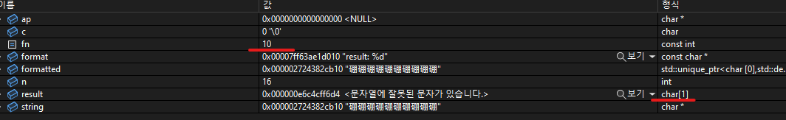

# LOOT AT ME!

> **date**: 22.12.14. - <br>
> **author**: timothy-20 <br>
> **subject**: c++ 문법을 익히던 도중 시도해 본 내용에 대하여.<br>
> **project name**: TKMFCApplication221201

constexpr의 const_cast?
---
```c++
constexpr int fn(1);
//...
int& mutableFn = const_cast<int&>(fn);
mutableFn = vsnprintf(&formatted[0], n, format, ap);
//...
char result[fn]{};
```
<br>
> 실제로 상수 시간에 fn(constexpr)의 초기값으로 배열의 크기가 정해지고, 'const_cast'가 진행된 이후 값이 변동되었기 때문에 배열의 크기는 <b>char[1]</b>입니다.

constexpr 또한 const_cast 연산자를 통해 상수성을 제거할 수 있습니다.

생 포인터(raw pointer)의 위험성을 깨닫게 해준 경험
---
```c++
class TKDummy
{
private:
	std::string m_name;

protected:
	std::vector<std::string>* m_names;

public:
	TKDummy(const std::string& dummyName) : m_name(dummyName)
	{
		std::cout << "Create 'TKDummy' object" << std::endl;

		this->m_names = new std::vector<std::string>();

		for (int i = 0; i < 10; i++)
		{
			std::string newName(::FormatWithChar("%s-%d", this->m_name.c_str(), i));
			this->m_names->push_back(newName);
		}
	}
	virtual ~TKDummy()
	{
		std::cout << "Clear 'TKDummy' object" << std::endl;

		this->m_name = "";
		delete this->m_names;
		this->m_names = nullptr;
	}

	virtual std::vector<std::string>* GetNames() const 
	{
		return this->m_names;
	}
};

const std::vector<std::string>* GetNamesProxy()
{
	TKDummy dummy("Timothy");
	return dummy.GetNames();
}
```
> 이제까지 문법을 최대한 적용해서 구현해본 소스 코드(잡탕)입니다.

예상하셨겠지만, 위 코드는 'GetNamesProxy' 함수의 범위가 끝나는 순간 멤버 변수가 초기화되며 nullptr를 반환합니다.