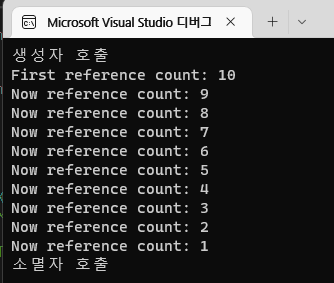
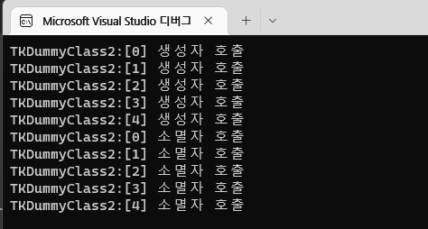
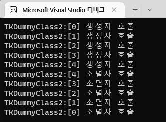

# LOOT AT ME!

> **date**: 22.12.15. - <br>
> **author**: timothy-20 <br>
> **subject**: c++ 문법을 익히던 도중 시도해 본 내용에 대하여.<br>
> **project name**: TKMFCApplication221201

[1] std::vector, rbegin
===
> 참고한 글: https://stackoverflow.com/questions/16609041/c-stl-what-does-base-do
```c++
std::vector<int> container{1, 2, 3, 4, 5};
auto rb(container.rbegin());

std::cout << *(rb + 2) << std::endl; //expect 3
std::cout << *((rb + 2).base()) << std::endl; expect 3
```
위 예제에서 제가 예상한 출력 값은 3, 3 입니다. <b>**base()**</b>가 그저 reverse_iterator를 정방향으로 돌린 것 뿐이기에 두 iterator가 가르키는 값은 동일할 것이라고 생각했기 때문입니다.

<br>
> 'base()'가 반환한 iterator는 다른 값을 가르키고 있습니다.

하지만 제 예상과는 달랐습니다. 이것이 중간 index의 값을 가르킨 것이라 망정이지

```c++
std::cout << *rb.base() << std::endl;
```
이런식으로 마지막 값을 가르켰다고 생각하고 출력을 시도했다면 분명 범위 밖의 nullptr를 맞닥뜨리게 될 것이고, 필히 런타임 에러를 발생시켰을 것입니다.

실제로 참고한 글에 따르면 역방향 참조자와 역방향 참조자의 'base()'가 <b>가르키고 있는 물리적인 값(*rb)이 다르며,</b>.
이는 역방향 참조자가 한 요소를 가르키면 그 이전 요소를 역참조 하므로 <b>역방향 참조자 자체의 논리적 값(pointer) 물리적(pointer의 역참조 값)이 다르기 때문입니다</b>.

이를 제가 이해한 방식대로 쉽게 설명해보자면, 
1. std::vector의 'end()'는 마지막의 다음 요소(nullptr)를 가르킵니다.
2. 그렇기에 std::vector의 'rbegin()'는 'end()'의 전 요소를 가르켜야 마지막 요소에서 시작할 수 있습니다.
3. 2번의 **이전 요소 역참조** 원리에 따라 'rb + 2' reverse_iterator 객체의 **논리적 지정** 값은 **4**(nullptr -> 5 -> 4)입니다.
4. 해당 reverse_iterator의 'base()' 함수는 객체의 논리적 지정을 기준삼아, 이를 iterator로 변경시킵니다.
5. iterator는 논리적 지정과 물리적 지정이 동일하다. 따라서 4를 가르킵니다. 

그러므로 출력은 3, 4여야지 옳습니다.

따라서 'rb'와 동일한 'rb.base()' 값을 얻기 위해서는 다음과 같아야 합니다.
```c++
std::cout << *((rb + 2).base() - 1) << std::endl;
```
<br>
> 이제야 의도한 값을 역참조했습니다.


[2] shared_ptr
===
> 출처: https://modoocode.com/252
```c++
std::vector<std::shared_ptr<TKDummyClass2>> dummyContainer;
	
for (int i(0); i < 10; i++)
{
    if (i == 0)
    {
        dummyContainer.emplace_back(new TKDummyClass2());
        continue;
    }
    
    dummyContainer.push_back(dummyContainer[(i - 1)]);
}

std::cout << "First reference count: " << dummyContainer[0].use_count() << std::endl;

for (auto iterator((dummyContainer.end() - 1)); iterator != dummyContainer.begin();)
{
    --iterator;
    dummyContainer.erase((iterator + 1));

    std::cout << "Now reference count: " << dummyContainer[0].use_count() << std::endl;
}
```
<br>
> vector의 **erase()**를 이용해 0번에 할당되어 있는 shared_ptr 객체를 참조하는 1 ~ 9 인덱스 상의 객체들을 역순으로 지워보았습니다.

사실 굳이 역순으로 지울 필요가 없습니다. **0번 인덱스의 객체 조차도 heap 메모리에 할당된 값(TKDummyClass2)을 shared_ptr로 참조있는 값 중 하나**이기 때문입니다(기존 0번 인덱스의 값이 지워진다고 해서 할당이 해제되지 않음). 
'begin()'을 이용해 0번 인덱스부터 지워도 여전히 1 ~ 9까지의 인덱스들이 역참조 값을(정확히는 reference count를 0 이상으로) 유지하고 있습니다.

그렇기에 해당 예제는 참고한 글과 다르게 하고 싶었던 개인적인 고집에서 비롯된 것입니다:)

---

[2.1] shared_str 번외
---
> 'main()' 내부에 개별적으로 스코프를 주어 container 안에 각기 생성된 shared_ptr 객체의 소멸을 관찰해 보았습니다.<br>
> 여기서 제가 알고 싶었던 것은 container 내부의 객체들의 소멸 순서였습니다.
```c++
class TKDummyClass2
{
private:
	const short m_id;

public:
	TKDummyClass2(short id) : m_id(id) { std::cout << "TKDummyClass2:[" << this->m_id << "] 생성자 호출" << std::endl; }
	~TKDummyClass2() { std::cout << "TKDummyClass2:[" << this->m_id << "] 소멸자 호출" << std::endl; }
};

// entry point
{
    std::vector<std::shared_ptr<TKDummyClass2>> container;

    for (int i(0); i < 5; i++)
        container.push_back(std::make_shared<TKDummyClass2>(i));
} // nested scope
```
<br>
생성된 순서대로 소멸이 진행됩니다.

```c++
{
    constexpr int size(5);
    std::shared_ptr<TKDummyClass2> arr[size];
    
    for (int i(0); i < size; i++)
       arr[i] = std::make_shared<TKDummyClass2>(i);
} // nested scope
```
<br>
흥미롭습니다, 배열로 테스트한 경우에는 가장 늦게 생성된 순서대로 소멸이 진행됩니다.