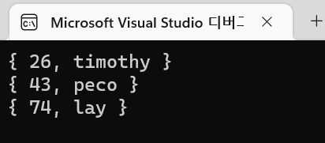

# LOOT AT ME!

> **date**: 22.12.16. - <br>
> **author**: timothy-20 <br>
> **subject**: c++ 문법을 익히던 도중 시도해 본 내용에 대하여.<br>
> **project name**: TKMFCApplication221201

[1] template
===
> 참고한 글:
> - https://modoocode.com/219
> - https://learn.microsoft.com/en-us/cpp/cpp/templates-cpp?view=msvc-170#template_parameters

이제는 c++뿐만 아니라 많은 언어에서도 generic이란 형태로 차용하고 있는 개념이지만, c++만큼 활용도가 높은 언어는 많지 않을 것입니다. 

[1.1] 매개변수 템플릿 및 기본 템플릿 인수
---
```c++
template<typename T, size_t SIZE>
class TKArray
{
public:
    std::vector<T> value = std::vector<T>(SIZE);
};

template<typename T, template<typename = T, size_t = 0> class Arr = TKArray>
class TKClass2
{
public:
    T value;
    Arr<> list;
};

// entry point
TKClass2<int> class1;
auto list(class1.list.value);

list.push_back(10);
list.push_back(20);
list.push_back(30);

for (auto element : list)
    std::cout << "value:" << element << std::endl;
```
해당 문법을 전부 활용해 본 예제입니다. 하나씩 뜯어보겠습니다.

TKClass2의 2번째 템플릿 인자인 

```c++
template<typename, size_t> class Arr
```
'Arr'는 템플릿 내부에서 템플릿 인자를 가지는 클래스 타입을 의미합니다. 템플릿 인자로써 사용되는
템플릿의 인자들은 이름을 가지지 않을 수 있습니다(명시해 둘 수는 있으나, 'Arr' 템플릿 매개 변수에는 본문이 없으므로
사용할 곳이 없습니다). 'Arr' 템플릿 인자는 타입 및 값 인자를 가집니다.

```c++
Arr<int, 10> m_list;
```
위와같이 TKClass2의 멤버로써 사용할 수 있습니다. 

```c++
template<typename T, template<typename = T, size_t = 0> class Arr = TKArray>
```
템플릿은 클래스의 멤버 함수 인자처럼 기본 인자를 가질 수 있습니다. 만일 템플릿의 인자의 아무 타입 혹은 값을
지정하지 않았다면 기본 인자로 대체됩니다. 위 코드에서는 **템플릿 인자의 기본 인자**를 보여주고 있습니다.

```c++
template<typename T = int, template<typename = T, size_t = 0> class Arr = TKArray>
class TKClass2
{ ... };
        
// entry point
TKClass2<> classA; // TKClass2<int, TKArray<int, 0>> classA; 로 연역됩니다.
```
만일 모든 템플릿의 인자가 기본 인자로 대체될 인스턴스를 생성할 경우, 타입 이후에 빈 괄호를 통해 
템플릿 타입임을 명시해 주어야 합니다.

[1.2] 템플릿 특수화
---
```c++
template <typename KEY, typename VALUE> 
class TKDictionary
{
protected:
    KEY* m_keys;
    VALUE* m_values;
    int m_size;
    int m_maxSize;

public:
    TKDictionary(int size) : 
        m_size(0),
        m_maxSize(1)
    {
        while (size >= this->m_maxSize)
            this->m_maxSize *= 2;
    
        this->m_keys = new KEY[this->m_maxSize];
        this->m_values = new VALUE[this->m_maxSize];
    }
    
    virtual ~TKDictionary()
    {
        delete[] this->m_keys;
        delete[] this->m_values;
    }
    
    // utils
    virtual void Add(KEY key, VALUE value)
    {
        KEY* keyTemp(nullptr);
        VALUE* valueTemp(nullptr);
    
        if (this->m_size + 1 > this->m_maxSize)
        {
            this->m_maxSize *= 2;
            keyTemp = new KEY[this->m_maxSize];
            valueTemp = new VALUE[this->m_maxSize];
    
            for (int i(0); i < this->m_size; i++)
            {
                keyTemp[i] = this->m_keys[i];
                valueTemp[i] = this->m_values[i];
            }
    
            keyTemp[this->m_size] = key;
            valueTemp[this->m_size] = value;
            delete[] this->m_keys;
            delete[] this->m_values;
            this->m_keys = keyTemp;
            this->m_values = valueTemp;
        }
        else
        {
            this->m_keys[this->m_size] = key;
            this->m_values[this->m_size] = value;
        }
    
        this->m_size++;
    }
    
    virtual void Print() const
    {
        for (int i(0); i < this->m_size; i++)
            std::cout << "{ " << this->m_keys[i] << ", " << this->m_values[i] << " }" << std::endl;
    }
};

template <typename VALUE>
class TKNumericDictionary : public TKDictionary<int, VALUE>
{
public:
    TKNumericDictionary(int size) : TKNumericDictionary::TKDictionary(size)
    {}
    
    void BubbleSort()
    {
        int smallest(0);
    
        for (int i(0); i < this->m_size - 1; i++)
        {
            for (int j(i); j < this->m_size; j++)
            {
                if (this->m_keys[j] < this->m_keys[smallest])
                    smallest = j;
            }
    
            std::swap(this->m_keys[i], this->m_keys[smallest]);
            std::swap(this->m_values[i], this->m_values[smallest]);
        }
    }
};

// entry point
TKNumericDictionary<const char*> dictionary(5);

dictionary.Add(43, "peco");
dictionary.Add(26, "timothy");
dictionary.Add(74, "lay");
dictionary.BubbleSort();
dictionary.Print();
```
위 소스코드는 msdn의 예제를 따라한 key-value dictionary class 입니다. 그리고 템플릿 특수화를 통해 key값은 integer형의 
id 값을 받는 'TKNumericDictionary'를 구현해 보았습니다. 기존 예제와 차별을 둔 부분은 상속을 통해 불필요한 코드의 중복을
줄인 부분에 있습니다.

<br>
> 결과 화면입니다.

[2] template 응용
===
[2.1] type이 다른 template 검사
---
> 참고한 글:
> - https://stackoverflow.com/questions/17390605/doing-a-static-assert-that-a-template-type-is-another-template
> - https://stackoverflow.com/questions/17392621/using-a-template-alias-instead-of-a-template-within-a-template

```c++
template<typename T>
struct TKDummyTemplate {};

template<typename T>
struct IsInstantiationOfDummy : public std::false_type {};

template<typename ...Ts>
struct IsInstantiationOfDummy<TKDummyTemplate<Ts...>> : public std::true_type {};

template<typename T>
struct TKTemplateChecker
{
	static_assert(IsInstantiationOfDummy<T>::value, "Fail template type!");
};

template<typename T> using TKDummyTemplateAlt = TKDummyTemplate<T>;

// entry point
TKTemplateChecker<TKDummyTemplate<int>> template1;
TKTemplateChecker<TKDummyTemplateAlt<int>> templateAlt1;
```
template 항목 정리 이후 마저 작성할 것.