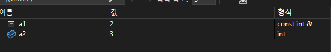

# LOOT AT ME!

> **date**: 22.12.20. - <br>
> **author**: timothy-20 <br>
> **subject**: win32 프로젝트를 진행하던 중에 궁금해진 c++에 대하여.<br>
> **project name**: TKMFCApplication221201

[1] const reference 인자
===
통상적으로 레퍼런스(&)라 불리는 해당 개념은 엄밀히 말하자면 **좌측값 레퍼런스**입니다.
그렇기에 레퍼런스에는 우측값을 넘길 수 없습니다. 이는 **call by reference**의 경우에도 동일합니다.
```c++
void GetReferenceInteger(int& integer)
{
    // ...
}

// entry point
::GetReferenceInteger(10); // compile time error
```

하지만 우리는 c++의 복사 생성자를 통해 우측값을 문제없이 전달했습니다. 분명히 인자의 타입이 좌측값 레퍼런스임에도 말입니다.  
```c++
class T
{
public:
    T() = default;
    T(const T& other)
    {
        // ...
    }
};

T GetT()
{
    T t;
    return t;
}

// entry point
T t1(::GetT()); // possible
```
T의 객체를 반환하는 함수(rvalue)를 인자에 전달함에도 경고가 발생하지 않습니다. 조금은 아리송하지만 우리는
이전의 좌측값 레퍼런스 인자와는 다르게 복사 생성자의 인자가 **const T&** 형태로 차이가 있음을 발견할 수 있었습니다.

이처럼 **상수 좌측값 레퍼런스**는 non-const lvalue, const lvalue, rvalue 모두를 인자로 받을 수 있습니다.
또한 수정되지 않음(readonly)을 보장함으로써 복사 생성자의 규격으로써 사용됩니다(이러한 이유로 수정될 필요가 없는
rvalue를 받을 수 있는 레퍼런스 형태가 아닌가 생각합니다).

[1.1] 우측값의 lifetime 연장
---
그리고 상수 좌측값 레퍼런스가 표현식(rvalue)을 참조할 때, 원래라면 해당 라인에 그칠 표현식의 lifetime을 참조형 변수의
수명만큼 연장시킵니다.

```c++
const int& a1 = 1 + 1; // 1
int a2 = 1 + 2; // 2
```
1, 2의 차이가 없다고 느껴질 수 있습니다. 하지만 

<br>
중단점에서 확인한 대상의 속성은 1번에 대해서는 표현식 자체를 보존하는 **지속적인** 대상임을 밝히고 있습니다. 

2번에서 '1 + 2' 