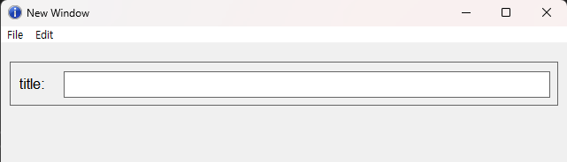

# LOOT AT ME!

> **date**: 22.12.20. - <br>
> **author**: timothy-20 <br>
> **subject**: win32 api를 이용하여 창을 구현해 보던 중에 알게된 사실에 대하여.<br>
> **project name**: TKMFCApplication221201

[1] Window 크기 조정
===
> 참고한 글:
> - https://m.blog.naver.com/PostView.naver?isHttpsRedirect=true&blogId=gustncjswp95&logNo=150140369368

> - 환경: Windows 11
> - 단위: px

[1.1] 사용자 정의 창 크기
---
>    - x, y : CW_USEDEFAULT
>    - width : 640
>    - height : 480

가장 초기에 설정한 base window 크기입니다.  

[1.2] 조정된 창 크기
---
```c++
RECT rect{ 0, 0, 640, 480 };

::AdjustWindowRect(&rect, WS_OVERLAPPEDWINDOW, false);

int adjustWidth(rect.right - rect.left);
int adjustHeight(rect.bottom - rect.top);
```
> - origin
>   - left : -8
>   - top : -31
>   - right : 648
>   - bottom : 488
> - size
>   - width : 656
>   - height : 519

'AdjustWindowRect'를 통해 metrics의 크기를 포함한 조정된 frame 크기를 계산합니다.

[1.3] window system metrics
---
```c++
int frameX(::GetSystemMetrics(SM_CXFRAME));
int frameY(::GetSystemMetrics(SM_CYFRAME));
int captionY(::GetSystemMetrics(SM_CYCAPTION));
```
>    - frameX : 4
>    - frameY : 4
>    - captionY : 23

'GetSystemMetrics'를 통해 값을 얻었습니다.

[1.4] 창 생성 이후 크기 조정
---
```c++
::SetWindowPos(hWndBackground, nullptr, 10, 20, (width - 20), 50, SWP_DRAWFRAME);
```
조정되는 대상의 부모 창을 기준으로 위치가 조정됩니다. 따라서 

> hWndBackground(부모) -> hWndTitleLabel, hWndTextField(자식) 

관계인 window handler의 크기는 상위 뷰의 rect 가져와, 해당 값을 기준으로 설정합니다.

```c++
int width(640), height(480);
		
::SetWindowPos(hWndBackground, nullptr, 10, 20, (width - 20), 50, SWP_DRAWFRAME);

RECT backgroundFrame(this->GetRect(hWndBackground));
int backgroundFrameWidth(backgroundFrame.right - backgroundFrame.left);
int backgroundFrameHeight(backgroundFrame.bottom - backgroundFrame.top);

::SetWindowPos(hWndTitleLabel, nullptr, 10, ((backgroundFrameHeight - 20) * 0.5), 50, 20, SWP_DRAWFRAME);
::SetWindowPos(hWndTextField, nullptr, 60, 10, (backgroundFrameWidth - 70), (backgroundFrameHeight - 20), SWP_DRAWFRAME);

// utils
RECT GetRect(HWND hWnd)
{
    RECT rect;
    
    if (::GetWindowRect(hWnd, &rect) == FALSE)
    {
        ::OutputDebugString(L"Unable to get windows RECT.");
        return {};
    }
    
    return rect;
}
```


깔끔하게 배치되었습니다.

### [1.4.1] 내부 요소들이 조정되어 배치되는 사용자 정의 TextField
위 내용들을 응용하여 구현해 보겠습니다.