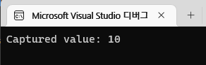
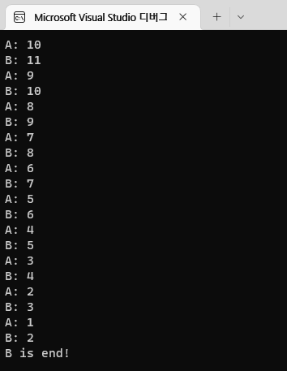

# LOOT AT ME!

> **date**: 22.12.22. - <br>
> **author**: timothy-20 <br>
> **subject**: c++ 문법을 익히던 도중 시도해 본 내용에 대하여.<br>
> **project name**: TKMFCApplication221201
>
[1] 람다식(Lambda)과 클로져(Closure)
===
> 참고한 글:
> - https://modoocode.com/196

[1.1] 클로져는 어느 시점에 값을 캡쳐하는가?
===
```c++
int a(10);
auto lambda([a] { std::cout << "Captured value: " << a << std::endl; } );

a = 20; // '20' 할당

lambda(); // ?
```
클로져의 캡쳐 값에 대해 공부하면서 무척 인상깊은 부분이었습니다. 이는 캡쳐 값은 **선언된 시점에서 결정**된다는 사실입니다.

<br>
이후 캡쳐 값이 원본이 변경된 것과 무관하게, 클로져 내에서는 선언된 시점에서의 값이 '10'이 그대로 출력됩니다.

```c++
auto lambda([&a] { std::cout << "Captured value: " << a << std::endl; } );
```
만일 레퍼런스 값이 캡쳐되어 있다면, 이후 원본 값 변경에 따라 캡쳐 값에 반영됩니다(레퍼런스일 경우 내부에서의 변경 또한 동일하게 반영됩니다). 

[1.2] 변경 가능한 내부 캡쳐 값
---
```c++
int number1(10);
auto makeDouble([number1](void) mutable -> int
    {
        number1 *= 2;
        return number1;
    }
);

std::cout << number1 << std::endl; // 10
std::cout << makeDouble() << std::endl; // 20
```
기본적으로 클로져의 캡쳐 값(=)은 const로 선언됩니다. 그렇기에 값으로써는 복사되었지만, 변경은 불가능하기에 해당 변수를 직접 활용하기 어렵습니다.
이때 **mutable 키워드**를 이용하여 캡쳐 값을 변경 가능하도록 지정합니다.

[1.3] 암시적 this 포인터 캡쳐
---
```c++
class TKGorp
{
private:
	std::vector<int> m_numberList;
	int m_modulus;

public:
	TKGorp(int modulus) :
		m_modulus(modulus),
		m_numberList(std::vector<int>())
	{
	}

	// Utils
	TKGorp& Put(int&& value)
	{
		this->m_numberList.push_back(value);
		return *this;
	}
	int GetExtraValues()
	{
		int count(0);
		
		std::for_each(this->m_numberList.cbegin(), this->m_numberList.cend(), [=, &count](int value) -> void
			{
				count += value % this->m_modulus; // list에 저장된 각 값의 나머지를 더합니다.
			}
		);

		return count;
	}
};

// entry point
TKGorp gorp(3);

gorp.Put(3).Put(10).Put(23).Put(23).Put(57).Put(79); // 1 + 2 + 2 + 0 + 1

std::cout << "result: " << gorp.GetExtraValues() << std::endl; // 6
```
나눌 값을 'gorp' 객체를 초기화 해주고, 객체 내부의 'm_numberList'에 임의의 숫자를 넣어줍니다. 'GetExtraValue'의 호출을 통해 list의 모든 요소들의 나머지 값을 
더한 결과를 반환합니다.

```c++
std::for_each(this->m_numberList.cbegin(), this->m_numberList.cend(), [=, &count](int value) -> void
    {
        count += value % this->m_modulus; 
    }
);
```
여기서 우리가 주목할 부분은 <b>[=]</b>([this])를 이용한 this 포인터 값의 캡쳐입니다. 이로 인해 우리는 클로져 안에서도 멤버에 접근할 수 있게됩니다.

```c++
[this] { this->m_value = 10; } // no mutable keyword
```
한 가지 기억할 것은 mutable 키워드를 사용하지 않은 클로져라도 우리가 캡쳐한 값은 this의 포인터이기 때문에, 내부의 멤버 변수는 변경이 가능합니다. 

[1.4] 클로져의 특수 멤버 함수
---
클로져도 자신의 캡쳐 값에 대한 생성, 복사, 이동, 소멸을 수행할 특수 멤버 함수를 가지고 있습니다.

[1.5] 재귀적 클로져
---
```c++
std::function<int(int)> func1;
std::function<int(int)> func2([&func1](int value) -> int
    {
        std::cout << "B: " << value << std::endl;

        if (value < 3)
        {
            std::cout << "B is end!" << std::endl;
            return 0;
        } 
        else 
        {
            return func1(value - 2);
        }
    }
);
func1 = [&func2](int value) -> int 
{
    std::cout << "A: " << value << std::endl;

    return func2(++value); 
};

func1(10);
```
결과가 예상과는 달랐습니다. 왜 이러한 결과가 나오는지 무척 의문입니다. <- 질문을 통해 답을 도출해 볼 것.

<br>
결과 화면입니다.

```c++
std::function<int(int)> factial;

factial = [&factial](int value) -> int
{
    if (value == 0)
        return 1;

    return value * factial(value - 1);
};

std::cout << "result: " << factial(4) << std::endl;
```
<- 무척 전통적인 재귀 구문이다. 실질적으로 구현하고 싶은 내용으로 응용해볼 것.

[2] 클로져 응용하기
===
[2.1] 클로져와 템플릿
---
```c++
template<typename T> 
using TKTemplateCallback = void(*)(T);

template<typename T>
TKTemplateCallback<T> g_checkType1 = [](T value) -> void
{
	std::cout << "[1] Type name: " << typeid(decltype(value)).name() << std::endl;
	std::cout << "[1] Value: " << value << std::endl;
};

template<typename T>
std::function<void(T)> g_checkType2 = [](T value) -> void 
{ 
	std::cout << "[2] Type name: " << typeid(decltype(value)).name() << std::endl; 
	std::cout << "[2] Value: " << value << std::endl;

};

// entry point
::g_checkType1<int>(10);
::g_checkType2<int>(20);
```
함수 포인터로도 응용해 보았습니다

[2.2] 고차함수
---
> 참고한 글:
> - https://velog.io/@un1945/Swift-%EA%B3%A0%EC%B0%A8%ED%95%A8%EC%88%98-Higher-order-Function

```c++
template<typename T, size_t SIZE>
void Reduce(T(&list)[SIZE], std::function<T(size_t, T)> callback)
{
	for (size_t i(0); i < SIZE; i++)
		list[i] = callback(i, list[i]);
}

// entry point
constexpr size_t size(3);
std::string list[size]{ "timothy", "peco", "ray" };

::Reduce<std::string, size>(list, [](size_t index, std::string element) -> std::string
	{
		if (index == 1)
		return "new one!";

return element;
	}
);
```
Swift의 **고차함수**(higher-order function) 'Reduce'를 template과 람다 함수 객체를 이용해 구현해 보았습니다.

[2.3] 클로져를 반환하는 함수
---
> 참고한 글:
> - https://ko.wikipedia.org/wiki/%ED%94%BC%EB%B3%B4%EB%82%98%EC%B9%98_%EC%88%98
> - https://stackoverflow.com/questions/22708543/how-do-i-return-a-closure-from-a-function
```c++
std::function<std::chrono::duration<double>&(void)> GetDurationTime()
{
	auto startTime(std::chrono::system_clock::now());
	
	return [=] () -> std::chrono::duration<double>& { 
		std::chrono::duration<double> duration((std::chrono::system_clock::now() - startTime));
		return duration; 
	};
}

long GetFibonacci(uint32_t value)
{
	if (value < 2)
		return value;

	return ::GetFibonacci(value - 1) + ::GetFibonacci(value - 2);
}

// entry point
auto durationTime(::GetDurationTime());

std::cout << "Result: " << ::GetFibonacci(42) << std::endl;

std::cout << std::fixed;
std::cout << "Duration time: " << durationTime().count() << std::endl;
```
time end point를 실행시키고 start point와의 차액을 통한 time duration을 반환하는 클로져를 반환하는 함수입니다.
'GetDurationTime' 함수의 호출과 반환된 클로져의 호출 사이에 특정 동작을 수행하는 코드를 삽입하여 수행 속도를 측정합니다.
