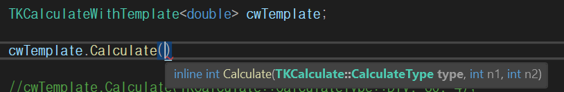

# LOOT AT ME!

> **date**: 22.12.26. - <br>
> **author**: timothy-20 <br>
> **subject**: c++ 문법을 익히던 도중 시도해 본 내용에 대하여.<br>
> **project name**: TKMFCApplication221201
>
[1] 클래스 멤버 포인터
===
> 참고한 글:
> - https://stackoverflow.com/questions/670734/pointer-to-class-data-member
> - https://m.blog.naver.com/rhkdals1206/221560597182

해당 개념에 대해서 찾아보게 된 계기는 msdn에서 설명하는 template 특수화에 대한 글을 읽었을 때였습니다. 
template 인자 타입으로 다음과 같은 특이한 정의를 보게 되었습니다.

```c++
template<typename T, typename U>
class TKClass<T U::*>
{ 
    // ...
};
```
해당 템플릿은 멤버 포인터 타입에 대해 특수화 되어있습니다. 예제에서 특수화한 멤버 포인터에 대해 알아보고자 합니다.

[1.1] 멤버 포인터 변수
---
```c++
struct TKStorage
{
    size_t size;
};

// entry point
TKStorage storage;
size_t TKStorage::* pSize(&TKStorage::size); // member pointer instance

storage.size = 10; // direct access
storage.*pSize = 20;

std::cout << "Storage size: " << storage.size << std::endl; // 20
```
'TKStorage' 구조체의 멤버 변수인 'size'의 멤버 포인터 인스턴스를 만들어 이를 일반적인 구조체의 멤버에 접근할 때처럼
사용합니다. 이때 인스턴스는 포인터이므로, 역참조를 통해 멤버에 접근하여 값을 수정합니다.
따라서 'size'를 직접 접근하여 변경한 후 '10'이 되고, 멤버 포인터의 역참조로 접근하여 '20'으로 변경합니다.
따라서 결과는 '20'입니다.

```c++
class TKStorage // aggregate class
{
public:
    int slot1;
    int slot2;
};

int SumSlotData(TKStorage* begin, TKStorage* end, int TKStorage::* slot)
{
    int temp(0);
    
    for (TKStorage* iter(begin); iter != end; iter++)
        temp += iter->*slot;
    
    return temp;
}

// entry point
TKStorage storage[6]{
    {20, 20}, // aggregate initialization 
    {20, 40},
    {20, 80},
    {20, 160},
    {20, 320},
    {20, 640}
};

std::cout << "result: " << ::SumSlotData(storage, (storage + 5), &TKStorage::slot1) << std::endl; // 100
std::cout << "result: " << ::SumSlotData(storage, (storage + 5), &TKStorage::slot2) << std::endl; // 620
```
위 예제는 멤버 포인터 변수를 이용한 각 slot 별 데이터(int)의 총합을 구하는 함수를 보여주고 있습니다.

[1.2] 멤버 포인터 함수
---
```c++
class TKCalculate
{
    typedef int (TKCalculate::* TKCalculateFunc)(int, int);

private:
    int Sum(int n1, int n2) { return n1 + n2; }
    int Min(int n1, int n2) { return n1 - n2; }
    int Mul(int n1, int n2) { return n1 * n2; }
    int Div(int n1, int n2) { return n1 / n2; }
    
    TKCalculateFunc operators[4]{
        &TKCalculate::Sum,
        &TKCalculate::Min,
        &TKCalculate::Mul,
        &TKCalculate::Div
    };

public:
    enum CalculateType { SUM = 0, MIN, MUL, DIV };
    
    int Calculate(CalculateType type, int n1, int n2)
    {
        return (this->*this->operators[static_cast<int>(type)])(n1, n2);
    }
};

// entry point
TKCalculate calculate;

std::cout << "result: " << calculate.Calculate(TKCalculate::CalculateType::SUM, 20, 10) << std::endl;
```
멤버 함수도 마찬가지로 함수 포인터 타입과 유사하게 선언합니다. 다만 함수 포인터 앞에 'TKCalculate'를 통해
범위(네임 스페이스)가 특정된다는 부분에서 차이가 있습니다. 예제에서 typedef를 이용해 멤버 포인터 함수의 타입을 지정해
코드를 간소화 시켰습니다. 또한 함수 포인터를 통해 배열을 구성할 수 있는 것과 동일하게 계산을 위한 유틸리티 함수들을
배열로 묶어 열거형과 함께 사용할 수 있도록 구현했습니다.

```c++
template <typename T>
class TKCalculateWithTemplate : public TKCalculate
{};

template <typename T>
struct TKCalculateWithTemplateFunc { typedef T(TKCalculateWithTemplate<T>::* func)(T, T); };

//template <typename T>
//using TKCalculateWithTemplateFunc = T(TKCalculateWithTemplate<T>::*)(T, T);

// entry point
TKCalculateWithTemplate<double> cwTemplate;

cwTemplate.Calculate(TKCalculate::CalculateType::DIV, 60, 4);
```
이번에는 template를 이용해 사용자 정의 타입을 가지는 인자를 받는 함수를 구현해 보기로 했습니다.
'TKCalculate'를 상속하여 기존에 구현해 두었던 계산 기능을 그대로 사용 가능하되, template를 통해
타입을 자유자재로 정해보도록 하겠습니다.

<br>
> template 역시 무척이나 아름답습니다

예전에 채용되던 방식이지만 구조체(혹은 클래스)를 이용한 typedef template 선언으로 구현해 보았습니다. 아래 주석처리되어 있는 부분은
'using' 키워드를 이용한 방식입니다.

[1.3] 기타
---
```c++
T Calculate(int(TKCalculateWithTemplate::* Func)(T, T), T n1, T n2)
{
    std::cout << "result: " << (this->*Func)(n1, n2) << std::endl;
}
```
참고로 멤버 포인터 함수는 이와같이 함수의 인자로도 사용할 수 있습니다.